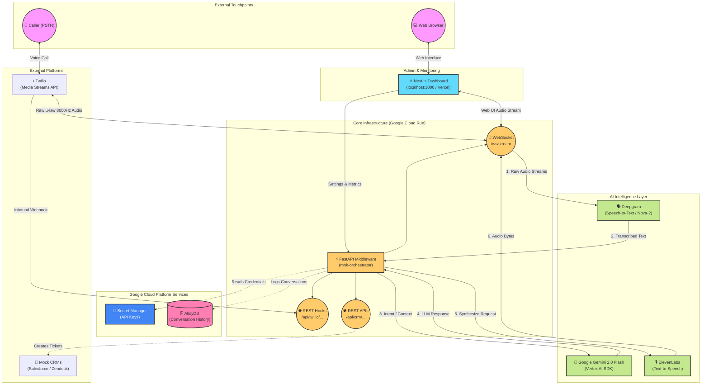

# MNK Voice Agent Suite - Architecture Diagram

This document contains a visual representation of the MNK Voice Agent Suite architecture, specifically designed for your Devpost hackathon submission. You can view this diagram on GitHub, or copy-paste the Mermaid code block below into any supported Markdown renderer (like Notion, GitHub, or Mermaid Live Editor).

### Component Breakdown
1. **Frontend (Next.js)**: The React-based dashboard used by administrators to monitor active live calls, interact with the agent via the browser, and track real-time LLM consumption and costs.
2. **Middleware (FastAPI on Google Cloud Run)**: The low-latency central nervous system of the suite. It maintains WebSocket connections to stream bytes instantly without HTTP overhead.
3. **Twilio Media Streams**: Allows standard phone calls (PSTN) to bypass traditional UI paths, streaming raw 8kHz mu-law audio directly into the FastAPI websocket interface.
4. **AI Models**:
   - **Deepgram** transcribes the raw inbound audio in real-time.
   - **Gemini 2.0 Flash** processes the intent, reasons over the context, and generates the text reply.
   - **ElevenLabs** turns the text reply back into a highly emotive human voice audio stream.
5. **GCP Backend**: Scales effortlessly to zero when not in use, natively using **Secret Manager** to securely load external API keys at runtime, and **AlloyDB** to persist interactions.
