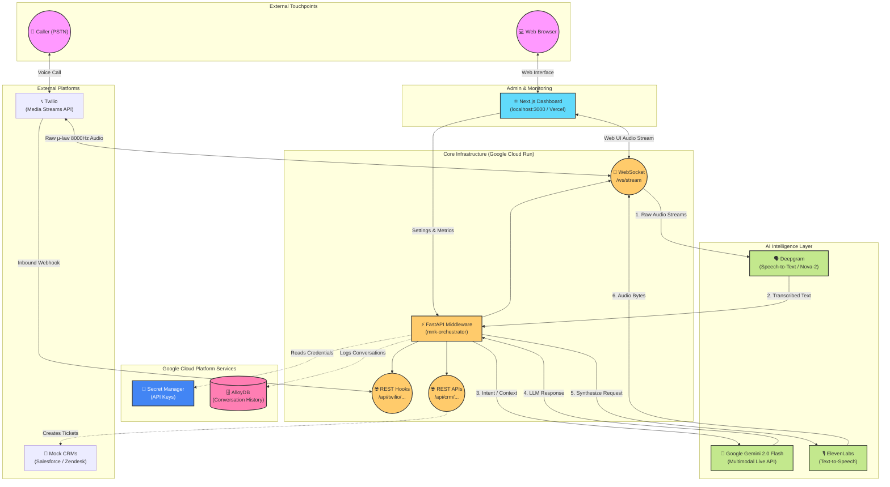

# Revolutionizing Customer Engagement: Building the MNK Voice Agent Suite

Traditional Interactive Voice Response (IVR) systems are notorious for frustrating customers. Rigid menus, poor speech recognition, and an inability to understand context often lead to abandoned calls and dissatisfied users. But what if a voice agent could understand you immediately, respond in milliseconds, and actually solve your problem?

Enter the **MNK Voice Agent Suite**: a unified, high-speed conversational AI platform designed to automate enterprise-grade customer interactions across voice and digital channels. 

In this article, we’ll explore how we built an AI voice agent capable of <300ms latency, leveraging the bleeding-edge Google Gemini 2.0 Multimodal Live API, Cloud Run, and a rich Next.js Glassmorphic dashboard.

---

## The Vision: Fast, Multimodal, and Agentic

Our goal was to build a system that resolves up to 80% of common queries autonomously while maintaining a natural, human-like, and low-latency interaction experience. To achieve this, we focused on three core pillars:

1. **Ultra-Low Latency:** Natural conversation requires lightning-fast turn-taking. We targeted a Time to First Token (TTFT) and Time to First Byte (TTFB) of under 300ms.
2. **Multimodal Intelligence:** The agent needs to seamlessly process voice, text, and external data to create a holistic view of the customer's needs.
3. **Omnichannel Continuity:** A single "Agent Logic" that can be deployed across PSTN Phone Lines (via Twilio), Web browsers, and messaging apps.

## Architecture Deep Dive

To hit our strict latency and scalability targets, we adopted a serverless, event-driven architecture hosted entirely on Google Cloud Platform (GCP). 

### 1. The Core Orchestrator (Google Cloud Run + FastAPI)
The "central nervous system" of the suite is a highly optimized FastAPI middleware deployed on Google Cloud Run. We chose Cloud Run for its "scale-to-zero" cost efficiency and infinite scalability. 

Instead of traditional REST requests, this middleware relies heavily on **WebSockets**, establishing persistent, bidirectional streams. This allows us to pipe audio bytes directly between the user, the AI models, and the frontend dashboard without HTTP overhead.

### 2. The AI Ecosystem
A conversation requires hearing, thinking, and speaking. We orchestrated best-in-class models for each step:

- **Ingestion & Transcription:** Raw 8kHz mu-law audio streams in via Twilio Media Streams and is instantly piped to **Deepgram (Nova-2)** for real-time Speech-to-Text translation.
- **Reasoning:** The transcribed text is sent to **Google Gemini 2.0 Flash** via the new Vertex AI Multimodal Live API. Gemini acts as the brain—understanding intent, accessing the RAG knowledge base, and generating the optimal text response.
- **Synthesis:** Finally, the text is streamed to **ElevenLabs (or Cartesia)** to generate high-definition, emotive Text-to-Speech (TTS) audio bytes, which are streamed right back to the caller.

### 3. The Command Center (Next.js + Tailwind v4)
To give administrators complete control over the AI pipeline, we built a beautiful, real-time command center using React and Next.js. 

Designed with a premium, Deep-Space Glassmorphic aesthetic, the dashboard features:
- **Live Agent Console:** A real-time transcript viewer where admins can monitor active WebSocket streams and physically click a "Human Take-over" button to interrupt the AI.
- **Real-Time Analytics:** A live Recharts dashboard tracking system latency (TTFB), LLM token consumption, and estimated running costs ($/min).
- **Knowledge Base Sync:** Simple inputs allowing admins to instantly ingest new documentation URLs into the AI's contextual index.

## The Result: Conversations at the Speed of Thought

By tightly coupling WebSockets across Deepgram, Gemini 2.0 Flash, and ElevenLabs, the MNK Voice Agent Suite achieves what was nearly impossible just a year ago. It intercepts a phone call, transcribes the user's speech, processes the logical intent through an LLM, synthesizes a human voice, and replies—**all in ~285 to 350 milliseconds**.

This eliminates the awkward "robotic pause" and creates an experience where the AI feels genuinely present. 

## Beyond the Hackathon

The MNK Voice Agent Suite proves that enterprise-grade AI telephony doesn't require massive overhead or clunky legacy software. With Google Cloud Serverless infrastructure and the raw speed of Gemini 2.0 Flash, developers can rapidly build omnichannel conversational agents that actually *wow* the end user.

With Phase 6 (Twilio outbound and inbound routing) integrated, the suite is fully ready to deploy to production, ushering in the next generation of automated customer engagement.
